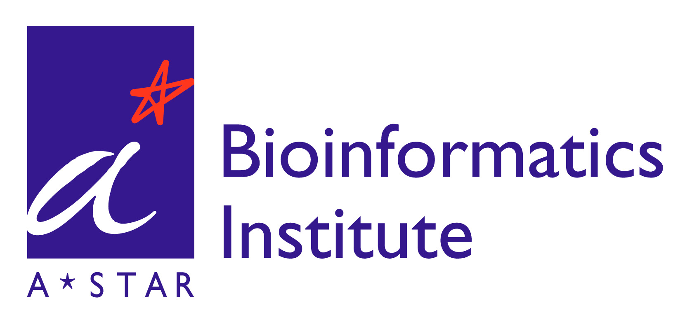
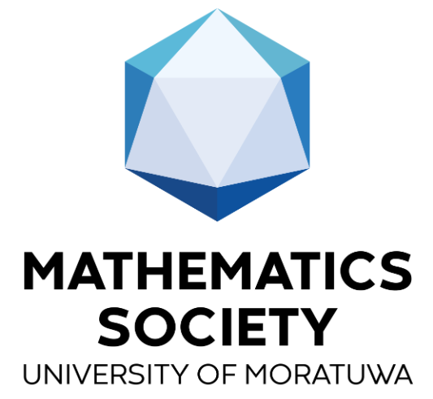

I am a 2nd-year PhD student at the Department of Biomedical Engineering at Johns Hopkins University, advised by <a href="https://scholar.google.com/citations?user=Ui8pnoIAAAAJ&hl=en">Prof. Michael I. Miller</a>. My current research lies in Computational Anatomy, particularly focusing on diffeomorphic frameworks and image varifold–based representations for cross-modality data mapping.	Recently, I have been exploring coordinate transformations modeled as geodesic flows, generated by Lagrangian and Eulerian velocity fields.

&nbsp;

	I completed my Bachelors in Biomedical Engineering (BME) at the Department of Electronic and Telecommunication Engineering (ENTC), University of Moratuwa, Sri Lanka in 2023. Subsequently, I worked as a Graduate Research Intern at the Bioinformatics Institute, Singapore, under the supervision of <a href="https://scholar.google.com.sg/citations?user=9ebsWAoAAAAJ&hl=en">Dr. Lee Hwee Kuan</a>, where I focused on Multi-instance and Multi-task learning models for Computational Pathology.

&nbsp;
 

Outside of work, I enjoy thinking about different philosophies and spend time watching Formula 1, cricket and anime.

&nbsp;
 

<!-- 
I am a Graduate Research Intern at the Bioinformatics Institute, Singapore. Currently, I am working on Multi-instance Learning and Multi-task Learning based models for Computational Pathology, under the supervision of <a href="https://scholar.google.com.sg/citations?user=9ebsWAoAAAAJ&hl=en">Dr. Lee Hwee Kuan</a>. My recent research interests lie in pattern recognition in histopathological images. More broadly, I am keen on studying statistical learning theory and applying theoretical knowledge to develop tools and frameworks for biomedical/ biological image analysis.

&nbsp;

	I completed my Bachelors in Biomedical Engineering (BME) with First Class Honors at the Department of Electronic and Telecommunication Engineering (ENTC), University of Moratuwa, Sri Lanka and received the gold medal for the best academic performance in the BME specialization. My undergraduate thesis project was on "Deep Geometric Framework to Predict Antibody-Antigen Binding Affinity" under the supervision of <a href = 'https://scholar.google.no/citations?user=VhyUxgcAAAAJ&hl=en'> Dr. Subodha Charles</a>. This research project was a collaboration with <a href="https://www.linkedin.com/in/ravinda-munasinghe-658a9982/">Dr. Aravinda Munasinghe</a>, Senior Research Scientist at Pfizer Inc., USA. During the undergraduate internship at Effective Solutions (Pvt) Ltd., Sri Lanka, I deployed deep-learning based models to predict Diabetic Retinopathy severity and segment neovascularization using fundus images. Further, as self-initiated research projects, I have worked on developing a paediatric anaesthesia monitoring system using EEG and ECG signals. 

&nbsp;
  -->

<!--  -->
<h2 class="section-title">News</h2>
	
 

   <table style = "border: none;width: 100%">
	<colgroup>
       		<col span="1" style="width: 20%;">
       		<col span="1" style="width: 80%;">
    	</colgroup>

    <tr>
    		<td style = "border: none;color:blue;font-size:17px;">December 2023</td>
    		<td style = "border: none;font-size:17px;"> Awarded the <b>Gold Medal</b> for the highest overall academic performance in Biomedical Engineering at the 44th General Convocation of the University of Moratuwa, Sri Lanka.</td> 	
	</tr>

	<tr>
    		<td style = "border: none;color:blue;font-size:17px;">November 2023</td>
    		<td style = "border: none;font-size:17px;"> Joined the <b>Bioinformatics Institute</b>, A*STAR, Singapore as a <b>Graduate Research Intern</b>.</td> 	
	</tr>

 	<tr>
    		<td style = "border: none;color:blue;font-size:17px;">July 2023</td>
    		<td style = "border: none;font-size:17px;"> Joined the <b>University of Moratuwa</b>, Sri Lanka as a <b>Visiting Instructor.</b></td> 	
	</tr>
    
	<tr>
    		<td style = "border: none;color:blue;font-size:17px;">June 2023</td>
    		<td style = "border: none;font-size:17px;"> Presented the undergraduate thesis project to the <a href="https://ent.uom.lk/"><b>Department of Electronic and Telecommunications Engineering</b></a> at the University of Moratuwa, Sri Lanka.</td> 	
	</tr>

	<tr>
    		<td style = "border: none;color:blue;font-size:17px;">September 2022</td>
    		<td style = "border: none;font-size:17px;"> Placed among the <b>top 5</b> solutions at the IEEE Video and Image Processing Cup (<b>VIPCUP 2022 - Open Competition</b>).</td> 	
	</tr>  

	<tr>
			<td style = "border: none;color:blue;font-size:17px;">July 2022</td>
    		<td style = "border: none;font-size:17px;"> <b>CAMSAT</b>: Paediatric Anaesthesia Monitoring System won the <b>1st runners-up</b> award at the <a href="https://ent.uom.lk/spark-at-uom/spark-challenge-2021-22-results/"><b>SPARK Challenge 2021/22</b></a>.</td>

	</tr>

	<tr>
			<td style = "border: none;color:blue;font-size:17px;">June 2022</td>
    		<td style = "border: none;font-size:17px;"> Submitted the preprint of the co-authored paper: <a href="https://www.researchgate.net/publication/368642404_Rethinking_Object_Detection_in_terms_of_Classification_and_Localization_through_Parallel_Deep_Learning_Models"><b>Rethinking Object Detection in terms of Classification and Localization through Parallel Deep Learning Models</b></a> for <b>ICIP 2022</b> review.</td>

	</tr>
    
	<tr>
    		<td style = "border: none;color:blue;font-size:17px;">January 2022</td>
    		<td style = "border: none;font-size:17px;"> Joined <b>Effective Solutions (Pvt) Ltd.</b>, Sri Lanka as a <b>Research Intern</b> in Biomedical Engineering.</td> 	
	</tr>
	   
	<tr>
			<td style = "border: none;color:blue;font-size:17px;">November 2021</td>
    		<td style = "border: none;font-size:17px;"> Won the <b>1st runners-up</b> award at the <a href="https://uom.lk/elect/news_events/team-stimulus-university-moratuwa-wins-first-prize-3rd-regional-association"> <b>3rd International Energy and Electricity Market Business Decision
			Simulation Competition</b></a>.</td>
	</tr>   
	   
	<tr>
    		<td style = "border: none;color:blue;font-size:17px;">September 2020</td>
    		<td style = "border: none;font-size:17px;"> Appointed as the<b> Vice President </b>of the <b>Mathematics Society</b> of University of Moratuwa, Sri Lanka.</td> 	
	</tr>
	
	<tr>
    		<td style = "border: none;color:blue;font-size:17px;">October 2018</td>
    		<td style = "border: none;font-size:17px;"> Started my Bachelors degree in Biomedical Engineering at University of Moratuwa, Sri Lanka.</td> 	
	</tr>
   </table> 
 

 

&nbsp;

Current and Past Affiliations:

  

