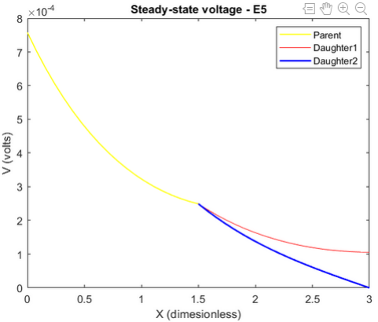

This section contains selected projects and simulations from my undergraduate years and earlier, archived for completeness.

# Projects
* **Patchwise Localization of Neovascularization in Fundus Images Using Transfer Learning**
  - *Self-initiated, Undergraduate Research Internship Project* [<a href = 'https://drive.google.com/file/d/1pdMF5yO26JVyZqFDgYLNlMHHPxDd7Doq/view?usp=sharing'>Report</a>] 
  - **Advisor**: 
    + <a href = 'https://scholar.google.com/citations?user=481sMoEAAAAJ'>Shashika Munasingha</a> (Doctoral Candidate), Auckland Bioengineering Institute, New Zealand

  -- *If the image is not clear, click <a href = '../images/dr.png'>here</a>.*

&nbsp;

* **Feature-Fused Parallel Deep Learning Model for Generalized Synthetic Image Detection [IEEE VIPCUP 2022]**
  - *Research Competition* [<a href = 'https://drive.google.com/file/d/1TGP0_vnvKNLODO7k_Oht_m7RB2WecerR/view?usp=sharing'>Report</a>] 
  - Our method was placed in the **Top 5** solutions
  - **Advisor(s)**: 
    + <a href = 'https://scholar.google.com/citations?user=qe5byo4AAAAJ&hl=en'>Dr. Chamira Edussooriya</a> (Senior Lecturer), University of Moratuwa, Sri Lanka
    + <a href = 'https://scholar.google.com.au/citations?user=Ctp3igcAAAAJ&hl=en'>Jathushan Rajasegaran</a> (PhD Student), BAIR, University of California, Berkeley, USA

&nbsp;

* **Parasitic Egg Detection and Classification in Microscopic Images**
  - *Research Competition* [<a href = 'https://www.researchgate.net/publication/368642404_Rethinking_Object_Detection_in_terms_of_Classification_and_Localization_through_Parallel_Deep_Learning_Models'>Preliminary Report for ICIP 2022 Grand Challenge</a>] 
  - **Advisor**: 
    + <a href = 'https://scholar.google.com.sg/citations?user=9ebsWAoAAAAJ&hl=en'>Dr Rukshani Liyanaarachchi</a> (Senior Lecturer), University of Moratuwa, Sri Lanka

* **CAMSAT: Paediatric Anaesthesia Monitoring System**
  - *Self-initiated Undergraduate Research* [<a href = 'https://drive.google.com/file/d/1jPVycFGds_hssIDrzRhg9aXx7OQUle6b/view?usp=sharing'>Report</a>] 
  - Won the **1st runners-up** award at the SPARK Challenge 2021/22 - Climate Change-oriented Innovation Competition, Organized by the University of Moratuwa, Sri Lanka

&nbsp;

* **Analysis of a Vibrotactile P300 Brain-Computer Interface Dataset from a Patient with Locked-in Syndrome**
  - *Virtual Hackathon, Spring School, G.tec Medical Engineering GmbH (2022)* [<a href = 'https://drive.google.com/file/d/1nFQiUXplHLS2WWsWD4tghbT-OT4DS-on/view?usp=sharing'>Presentation</a>][<a href = 'https://github.com/Sam54000/vibro-tactile-P300-lockedIn-patient'>Github</a>] 
  - **Collaborator**: 
    + <a href = 'https://scholar.google.com/citations?user=HCm1_UkAAAAJ&hl=fr'>Samuel Louviot</a> (PhD Student),  University of Lorraine, France

# Simulations
## Digital Filters for Biosignal Processing
Implemented the following digital filters on MATLAB and filtered biomedical signals, specifically noisy ECG signals. 
* Smoothing Filters
  - Moving average filters
  - Savitzky-Golay filters
* Ensemble Averaging
* FIR Derivative Filters
* FIR Filters based on Windows
  - Rectangular window
  - Hanning window
  - Hamming window
  - Blackman window
  - Kaiser window
* IIR Filters
  - Butterworth LPF

For more details: <a href = 'https://drive.google.com/file/d/1GRp5eKdRQ7RfSJI6jinCFlwDzy3G_77w/view?usp=sharing'>Report</a>

## Optimum and Adaptive Filters for Biosignal Processing
Conventional FIR and IIR filters are designed based on limited information on temporal and spectral characteristics of the signal. Moreover, one might say that they are ad-hoc filters as trial-and-error method is sometimes used to determine the filter specifications. 

On the other hand, optimum filters such as the Wiener filter could be employed for a given time series by considering the statistical characteristics of the signal and noise, under the following assumptions.
* Signal and noise processes are independent
* Signal and noise are stationary
* Desired signal is known
* Noise characteristics are known

When the signal and noise are non-stationary, we would have to apply filters that are optimal as well as adaptive. Some examples for such filters are, 
* Least Mean Square (LMS) method
* Recursive Least Squares (RLS) method

For more details: <a href = 'https://drive.google.com/file/d/1o5V144nOX08O-X7uEo6TzVeLjodfKjWH/view?usp=sharing'>Report</a>

## Continuous and Discrete Wavelet Transforms
Implemented continuous and discrete wavelet transforms using built-in MATLAB functions and applied them for denoising and compression of different signals. 

In the context of continuous wavelet transforms (CWT), there are many wavelet families such as Shannon, Mexican hat, Morlet, etc. However, the drawbacks of CWT include highly redundant computations which leads to the requirement of additional computational power and time consumption. Avoiding this, in discrete wavelet transform (DWT), the scaling and translation are performed in a discrete manner.

For more details: <a href = 'https://drive.google.com/file/d/1ibvX1KQhU91rrmV9r5tyR29LXqCfo0OY/view?usp=sharing'>Report</a>

## Branched Cylinders: Dendritic Tree Approximations
Explored some of the time independent electrical properties of single branched cables. Branched cables are an important means of modelling the passive electrical properties of axonal and dendritic trees. For convenience, trees exhibiting only one order of branching were considered. Nevertheless, the principles could be easily extended to higher order trees.

In the above diagram, V1,V21 and V22 are the membrane potentials of the respective branches. d1, d21 and d22 are the diameters of the parent and daughter branches respectively and X is axial distance.

By solving the differential equations with the given nodal and boundary conditions, steady-state voltage profile in each branch could be determined. 

For more details: <a href = 'https://drive.google.com/file/d/1jjmqrKMkHgaRf0pqWFG-mMN3Vr79IYv7/view?usp=sharing'>Report</a>

## Properties of the Hodgkin-Huxley equations
Many of the properties of the propagating action potential are similar to the membrane action potential. The features; <b>threshold, refractoriness</b> (absolute and relative), <b>repetitive activity, temperature dependence</b> that are observed physiologically, were simulated using the Hodgkin-Huxley equations.

For more details: <a href = 'https://drive.google.com/file/d/1UFPYGIXockZTfHUblWP9migdCa2Y3OCP/view?usp=sharing'>Report</a>

## Mathematical Modelling of Compartmental Systems
Many compartmental systems can be represented by a series of first-order differential equations.
* Bolies Glucose/ Insulin Model
* Riggs Model for Iodine Metabolism

For more details: <a href = 'https://drive.google.com/file/d/1D8cFy-ad_XFkPkeByfzMhiE7XNZY3Tkx/view?usp=sharing'>Report</a>

## Image Downsampling Processor
Designed and simulated/implemented a processor that could down-sample an input image using Vivado Design Suite. The input image was transmitted to the processor where the image was down-sampled and once finished, the results were sent back for display purposes.

      

Original and Downsampled Image

For more details: <a href = 'https://drive.google.com/file/d/17boW2Lucrl8q1lLBczsg5-FsFSRw2sct/view?usp=sharing'>Report</a>

## Object Counting on a Moving Conveyor Belt
Hexagonal nuts on a moving conveyor belt were detected and localized from a video stream using a conventional image processing pipeline including;
* Otsu Thresholding
* Morphological Closing
* Connected Component Analysis
* Contour Analysis

For more details: <a href = 'https://drive.google.com/file/d/1A49N0SqSG2mHoBpuD9Ckj3xq1O-_QkWk/view?usp=sharing'>Report</a>