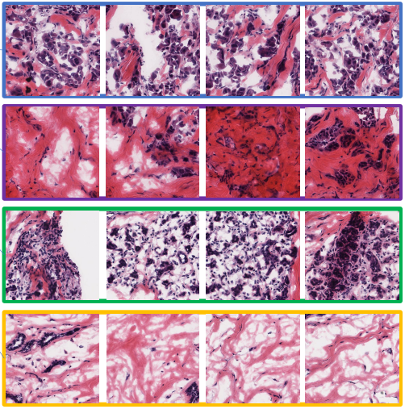
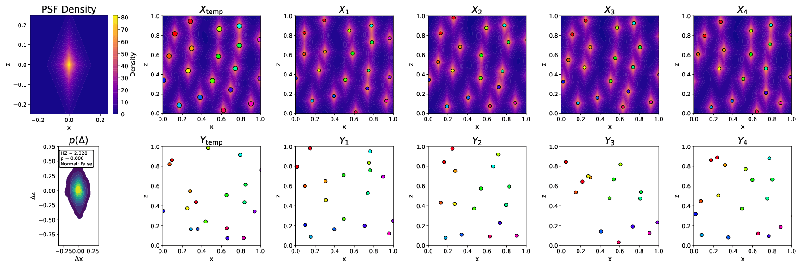
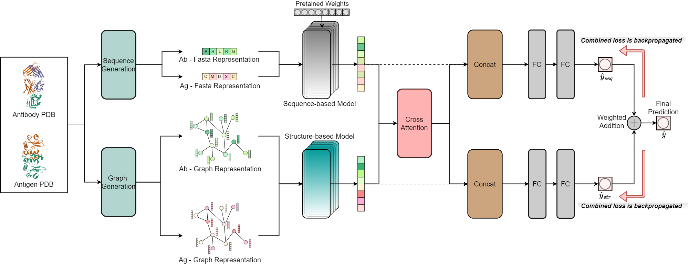

<b>Uncertainty-Gated Min-Cost Flows for In Vivo NanoScale Synaptic Plasticity Tracking</b> 
Shashwat Kumar, Gabrielle I. Coste, <b>Dasun Premathilaka</b>, Richard L. Huganir, Austin R. Graves, Adam S. Charles, and Michael I. Miller  
Preprint, 2025.  
[[arxiv](https://www.biorxiv.org/content/10.1101/2025.10.10.681691v1.full.pdf)]

<b> Deep Geometric Framework to Predict Antibody-Antigen Binding Affinity </b> 
Nuwan Bandara, <b>Dasun Premathilaka</b>, Sachini Chandanayake, Sahan Hettiarachchi, Vithurshan Varenthirarajah, Aravinda Munasinghe, Kaushalya Madhawa, and Subodha Charles 
Journal of Structural Biology, Volume 217, Issue 4, December 2025. 
[[paper](https://www.sciencedirect.com/science/article/pii/S1047847725000929)]

&nbsp;
 

# Research
<!-- ## On-going Projects
* **Multi-instance, Multi-task Learning for Cancer Histopathology Images**
  - *Graduate Research Internship Project(s)* 
  - **Supervisor(s)**: 
    + <a href = 'https://scholar.google.com.sg/citations?user=9ebsWAoAAAAJ&hl=en'>Dr. Lee Hwee Kuan</a> (Head of Research Division), Bioinformatics Institute, A*STAR, Singapore
    + <a href = 'https://github.com/sagizty'>Tianyi Zhang</a> (Research Officer), Bioinformatics Institute, A*STAR, Singapore

&nbsp;

## Past Projects -->
* **SynTrack: Nano-scale Synapse Tracking**
  - *Formulated synapse tracking as a MAP estimation problem, with a fully-connected spatio-temporal graph to handle long-term occlusions.* 
  - **Advisor(s)**: 
    + <a href = 'https://scholar.google.com/citations?user=0WhuKSwAAAAJ&hl=en'>Dr. Richard L. Huganir</a> (Professor), Johns Hopkins University, USA
    + <a href = 'https://scholar.google.com/citations?user=sJzw0U8AAAAJ&hl=en'>Dr. Austin R. Graves</a> (Assistant Research Professor), Johns Hopkins University, USA
    + <a href = 'https://scholar.google.com/citations?user=c8RKLp0AAAAJ&hl=en'>Dr. Adam S. Charles</a> (Assistant Professor), Johns Hopkins University, USA
    + <a href = 'https://scholar.google.com/citations?user=Ui8pnoIAAAAJ&hl=en'>Dr. Michael I. Miller</a> (Professor), Johns Hopkins University, USA

  -- *If the image is not clear, click <a href = '../images/synthetic_laplace.png'>here</a>.*

* **Deep Geometric Framework to Predict Antibody-Antigen Binding Affinity**
  - *Proposed a deep geometric network that shares information between structure and sequence-based models via cross-attention to predict antibody–antigen binding affinity.*
  - *Undergraduate Thesis Project* [<a href = 'https://drive.google.com/file/d/1NkxO8fNq3UGV0jqNu1U2A8QNA0jpSgeo/view?usp=sharing'>Thesis</a>]
  - **Supervisor(s)**: 
    + <a href = 'https://scholar.google.no/citations?user=VhyUxgcAAAAJ&hl=en'>Dr. Subodha Charles</a> (Senior Lecturer), University of Moratuwa, Sri Lanka
    + <a href = 'https://scholar.google.com/citations?user=gJ1BhRoAAAAJ&hl=en'>Dr. Aravinda Munasinghe</a> (Senior Research Scientist), Pfizer Inc., USA
    + <a href = 'https://scholar.google.com/citations?user=5ZSfU5wAAAAJ&hl=en'>Dr. Kaushalya Madhawa</a> (AI Scientist), University of Tokyo, Japan

  -- *If the image is not clear, click <a href = '../images/COMMODEL3.png'>here</a>.*

* **Multi-instance, Multi-task Learning for Cancer Histopathology Images**
  - *Graduate Research Internship Project(s)* 
  - **Supervisor(s)**: 
    + <a href = 'https://scholar.google.com.sg/citations?user=9ebsWAoAAAAJ&hl=en'>Dr. Lee Hwee Kuan</a> (Head of Research Division), Bioinformatics Institute, A*STAR, Singapore
    + <a href = 'https://github.com/sagizty'>Tianyi Zhang</a> (Research Officer), Bioinformatics Institute, A*STAR, Singapore

&nbsp;
